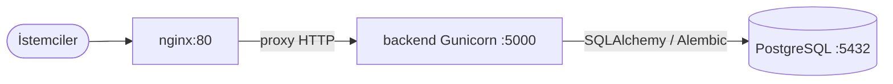

# Docker mimarisi (production)

## Bileşenler



| Servis   | Rol |
|----------|-----|
| **nginx** | Tek giriş noktası (80), ters vekil, `X-Forwarded-*`, istek gövdesi limiti |
| **backend** | Flask uygulaması `RestApi:app`, Gunicorn worker’ları |
| **db** | PostgreSQL 16, kalıcı volume `pgdata` |

## Çalıştırma

1. `.env.docker.example` dosyasını `.env.docker` olarak kopyalayın ve şifreleri/anahtarları doldurun.
2. Proje kökünde:

   ```bash
   docker compose --env-file .env.docker up -d --build
   ```

3. Sağlık kontrolleri: `http://localhost/health` (nginx üzerinden backend’e iletilir).

## Notlar

- Windows’ta `docker/entrypoint.sh` satır sonları **LF** olmalı (aksi halde Linux imajında `^M` hatası oluşabilir).
- Backend açılışta `migrate_db()` çalıştırır (şema + referans tohumları).
- Üretimde `FLASK_SECRET_KEY` ve `JWT_SECRET_KEY` zorunludur (`config.py`).
- `DATABASE_URL` içindeki parola özel karakter içeriyorsa [URL encoding](https://docs.sqlalchemy.org/en/20/core/engines.html#database-urls) kullanın.
